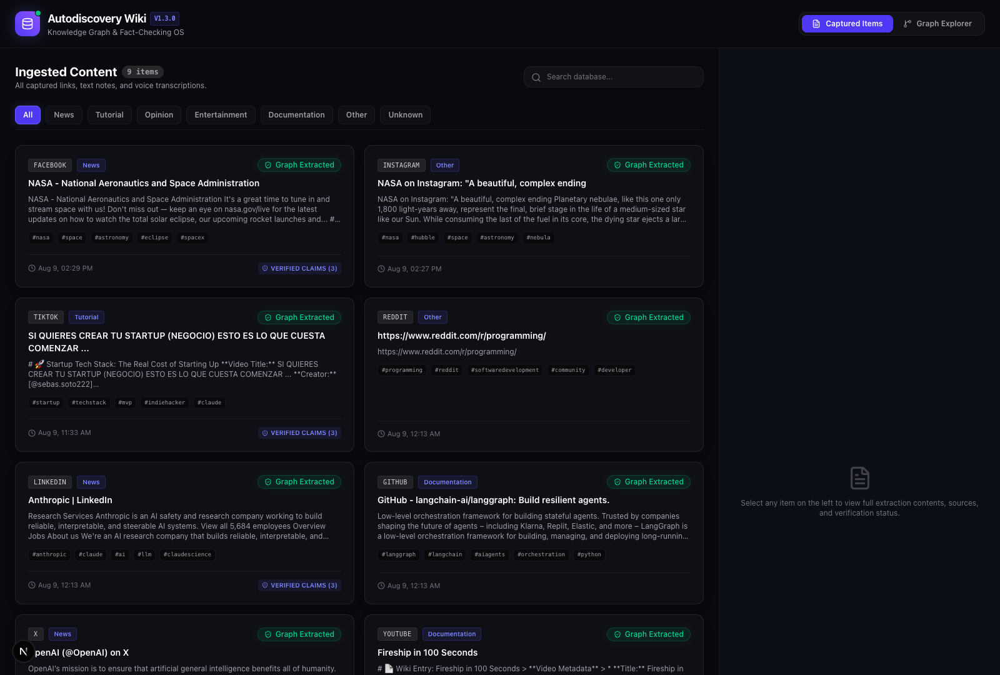
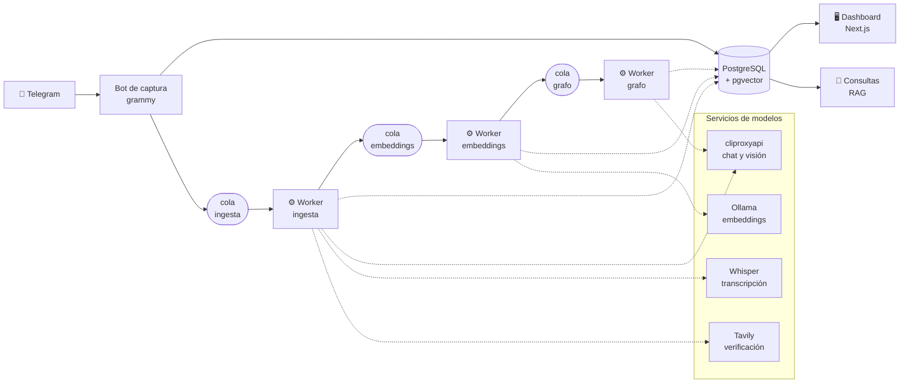
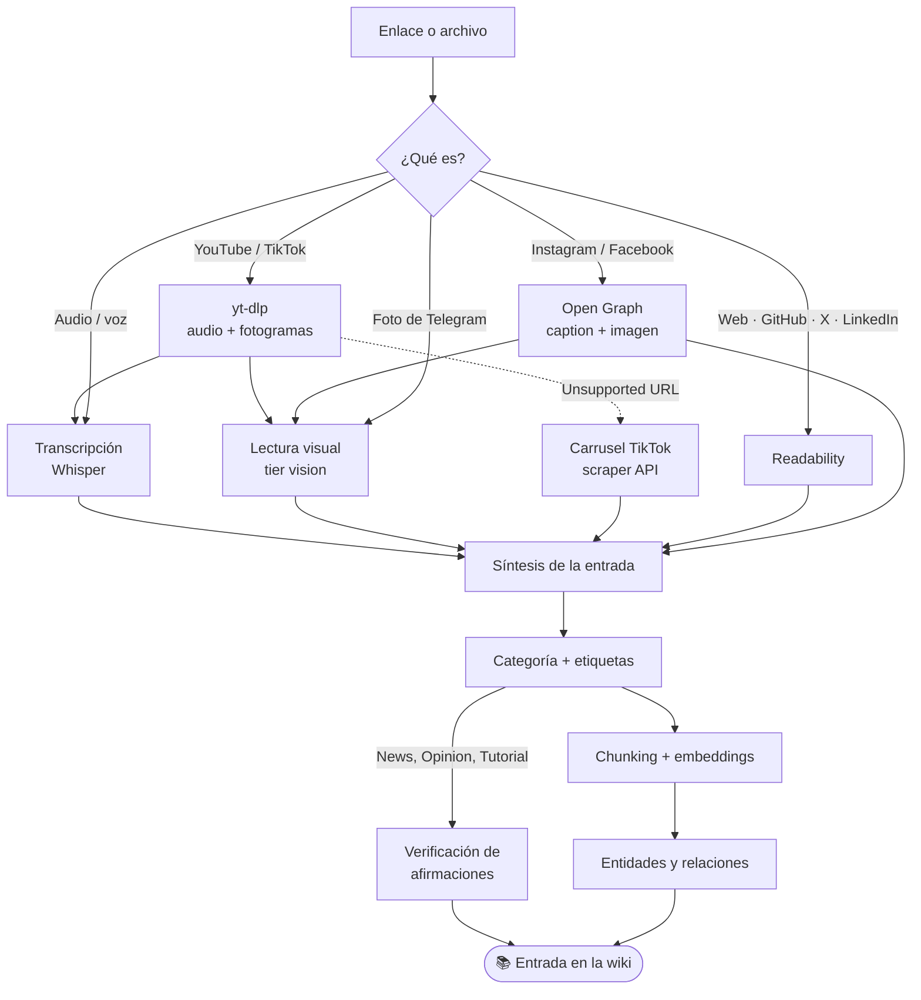

<div align="center">

# 🛰️ Autodiscovery Wiki

**Mandas un enlace por Telegram. Vuelve convertido en conocimiento.**

Captura, entiende, verifica y conecta todo lo que consumes en internet —
vídeos, carruseles, imágenes, artículos, audios— en una base de conocimiento
personal que puedes preguntar en lenguaje natural.

</div>



---

## Qué hace, en una frase

Le pasas un enlace de TikTok y te devuelve la transcripción de lo que se dice,
la lectura de lo que se ve en pantalla, una entrada de wiki redactada, sus
etiquetas, sus afirmaciones verificadas contra fuentes web, y las entidades
conectadas al resto de tu conocimiento. Todo buscable semánticamente, en
español y en inglés.

## Qué entiende hoy

| Fuente | Qué extrae | Estado |
|---|---|---|
| **YouTube** | subtítulos automáticos o transcripción, + lectura de fotogramas | ✅ |
| **TikTok (vídeo)** | transcripción del audio + lectura del texto en pantalla | ✅ |
| **TikTok (carrusel)** | transcripción literal de cada diapositiva | ✅ |
| **Instagram** (post público) | caption completo + lectura de la imagen | ✅ |
| **Facebook** (post público) | texto del post + lectura de la imagen | ✅ |
| **Fotos** por Telegram | descripción + transcripción del texto de la imagen | ✅ |
| **Audios y notas de voz** | transcripción con Whisper | ✅ |
| **Artículos web** | texto limpio vía Readability | ✅ |
| **GitHub · X · LinkedIn** | contenido de la página | ✅ |
| Reddit | — | ❌ requiere su propia vía |
| PDFs | metadatos, sin extraer texto | ❌ pendiente |
| Feeds de perfil (no posts) | — | ❌ inaccesibles sin sesión |

> **Sobre el OCR:** no hay Tesseract. El tier de visión lee el texto dentro de
> las imágenes directamente — verificado transcribiendo códigos no adivinables
> y las 8 diapositivas de un carrusel real, incluida una marca de agua en chino.

## Arquitectura



Redis mueve las tres colas (BullMQ). Cada etapa persiste su resultado antes de
encolar la siguiente, así que un fallo tardío nunca pierde el trabajo anterior.

## Cómo se convierte un enlace en conocimiento



Si una pieza falla, **el ítem queda marcado como degradado** en vez de aparentar
estar completo. Un fallo de visión, una transcripción vacía o un carrusel
inaccesible se registran con su motivo; nunca se guarda el texto del error como
si fuera contenido.

## El stack de modelos

Cada tier sale de configuración, ninguno está fijado en el código.

| Tier | Para qué | Por defecto |
|---|---|---|
| `flash` | categorización, etiquetas, RAG | modelo rápido vía cliproxyapi |
| `pro` | síntesis de la entrada final | modelo grande vía cliproxyapi |
| `vision` | lectura de imágenes y fotogramas (**es el OCR**) | modelo multimodal |
| embeddings | búsqueda semántica | `bge-m3` (1024 dims) en Ollama |
| transcripción | audio → texto | `faster-whisper large-v3` |

`bge-m3` se eligió midiendo: alineación translingüe de **0.93** entre una frase
en español y su traducción al inglés, frente a 0.33 con contenido no
relacionado. Whisper transcribe español, inglés y frases que mezclan ambos
(`"le metí un deploy al backend"`) sin degradarse.

## Puesta en marcha

**Necesitas:** Node 18+, Docker, un bot de Telegram
([@BotFather](https://t.me/BotFather)), y un endpoint de chat compatible con la
API de OpenAI.

```bash
git clone <este-repo> && cd autodiscovery-wiki
npm install
cp .env.example .env      # y rellena las credenciales
docker compose up -d      # PostgreSQL + Redis
npm run migrate           # crea el esquema
```

Levanta las piezas, cada una en su terminal:

```bash
npm start                 # bot de Telegram
npm run worker            # ingesta
npm run worker:embedding  # chunking + vectores
npm run worker:graph      # grafo de conocimiento
```

Y el dashboard:

```bash
cd frontend && npm install && npm run dev   # http://localhost:3000
```

> Requiere su propio `frontend/.env.local` con `DATABASE_URL` — Next.js solo lee
> variables de su propio directorio.

### Servicios locales opcionales

Embeddings y transcripción pueden correr en tu red, sin nube:

```bash
ollama pull bge-m3        # embeddings

pip install faster-whisper fastapi "uvicorn[standard]" python-multipart
# expón /v1/audio/transcriptions y apunta WHISPER_BASE_URL ahí
```

## Uso

En Telegram, manda cualquier cosa al bot: un enlace, una foto, un audio, una
nota de voz. Y para consultar:

```
/ask ¿qué estilos de UI puedo usar en mi app?
/verify <id-del-item>
```

`/ask` recupera por similitud vectorial, añade las relaciones del grafo y
responde citando las fuentes.

## Desarrollo

```bash
npm test        # 94 tests
npm run typecheck
```

Los tests están escritos para **fallar de verdad** cuando la funcionalidad se
rompe: varios se verificaron restaurando el bug a propósito y comprobando que la
suite se pone en rojo. Un guard que no puede fallar no es un guard.

```
src/
├─ bot/            captura por Telegram (client.ts crea; index.ts arranca)
├─ agents/         LangGraph: ingesta multimodal, categorización, verificación
├─ core/llm/       proveedores intercambiables y salida estructurada
├─ services/       análisis de imágenes, embeddings, chunking, RAG, grafo
├─ workers/        las tres colas y sus handlers por tipo de fuente
└─ db/             esquema y repositorios
```

Los cambios se planifican con [OpenSpec](openspec/) antes de implementarse, y
[`BACKLOG.md`](BACKLOG.md) mantiene el registro de lo auditado: qué se midió, con
qué comando, y qué salió — incluidas las conclusiones que resultaron falsas.

## Límites conocidos

- **Cinco procesos a mano.** No hay orquestación todavía; si olvidas el worker
  del grafo, el explorador aparece vacío sin decirte por qué.
- **El tablón no se refresca solo** ni muestra las imágenes de los posts.
- **Depende de servicios locales.** Si la máquina con Ollama o Whisper está
  apagada, esas etapas fallan.
- **Meta puede cambiar.** Instagram y Facebook funcionan porque sirven Open Graph
  a los crawlers, no por una API con contrato.
- **La síntesis rellena.** Las entradas incluyen contexto que aporta el modelo y
  no distingue lo observado de lo inferido.

---

<div align="center">
<sub>Base de conocimiento personal · construida para entender, no solo para guardar</sub>
</div>
